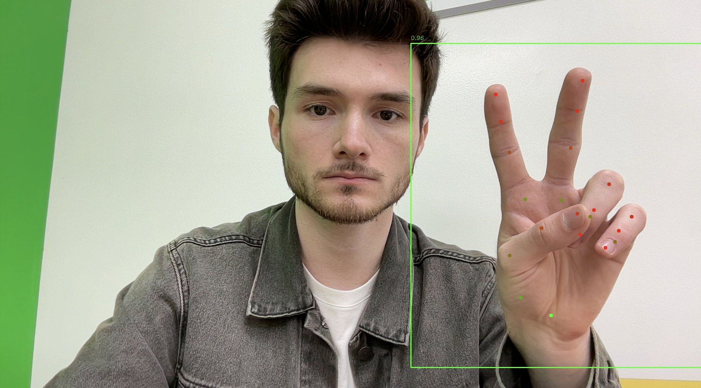

# RealtimeONNXHandtracking



A Python-based real-time hand tracking system using ONNX models and OpenCV. This project uses ONNX versions of MediaPipe's palm detection and hand landmark models to detect and visualize hand joints in live video input.

## Features

- Real-time palm detection
- 21-point hand landmark tracking
- Depth-based dot coloring (red for close, green for far)
- Automatically scaled and padded hand bounding boxes
- Works with a standard webcam and minimal setup

## Requirements

- Python 3.8 or later
- OpenCV
- NumPy
- ONNX Runtime

## How to Install OpenCV

Install all required packages using pip:

```bash
pip install opencv-python numpy onnxruntime
```

## How It Works

1. Captures webcam input using OpenCV
2. Uses a palm detection ONNX model to find hand regions
3. Expands the detected region with custom padding
4. Crops and resizes the hand area to 224×224
5. Runs a hand landmark ONNX model to get 21 joint positions
6. Displays each point with a color based on its depth (Z coordinate)

## Credit

The ONNX models used in this project were obtained from the following original repositories:

- Palm Detection Model (postprocessed 192x192):  
  https://github.com/PINTO0309/PINTO_model_zoo/tree/main/098_palm_detection/onnx

- Hand Landmark Model (sparse Nx3x224x224):  
  https://github.com/PINTO0309/hand-gesture-recognition-using-onnx
